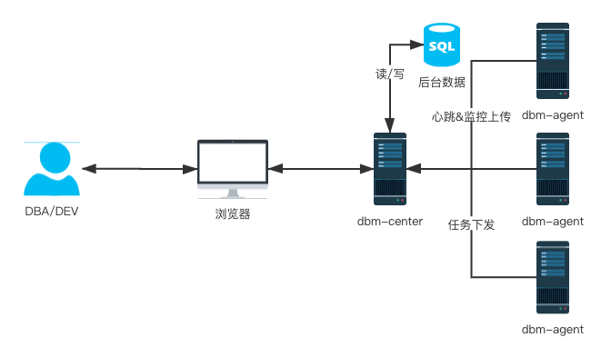
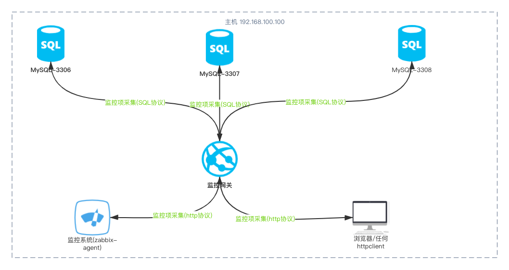

## 目录
---
- [dbm-agent](#dbm-agent)
- [依赖](#依赖)
- [安装](#安装)
- [初始化](#初始化)
- [dbm-agent集成的命令行工具](#dbm-agent集成的命令行工具)
   - [自动化安装单实例](#自动化安装单实例)
   - [自动化卸载](#自动化卸载)
   - [自动备份](#自动备份)
   - [自动增加Slave](#自动增加Slave)
   - [自动搭建MGR](#自动搭建MGR)
   - [自动安装mysql-shell](#自动安装mysql-shell)
   - [自动化配置innodb-cluster](#自动化配置innodb-cluster)
   - [自动化配置mysql-router](#自动化配置mysql-router)
   - [MySQL监控项采集dbma-cli-mysql-monitor-item](#MySQL监控项采集dbma-cli-mysql-monitor-item)
   - [自动化安装zabbix-agent](#自动化安装zabbix-agent)
- [数据库监控网关dbm-monitor-gateway](#数据库监控网关dbm-monitor-gateway)
- [数据库备份代理dbm-backup-proxy](#数据库备份代理dbm-backup-proxy)
- [启动](#启动)
- [关闭](#关闭)
- [升级](#升级)
- [卸载](#卸载)
- [交流与赞助](#交流与赞助)
- [常见问题解答](#常见问题解答)
- [开发文档](#开发文档)

---

## dbm-agent
  dbm 是一个软件套件，包含有 dbm-center 和 dbm-agent 两大组成部分；其中 dbm-center 可以看成一个 web 站点，DBA 通过它可以查看监控、告警、部署各种 MySQL 环境。
  dbm-agent 是 dbm-center 的助手，负责环境的部署、监控的采集与上报、数据库的备份与监控。总的来讲接活的 dbm-center 真正干活的是 dbm-agent。另外 dbm-agent 也集成了若干命令行工具，这使得它也可以单独使用。
  
  

  ---

  **dbm(DataBase Management center)-agent：MySQL|Redis 数据库管理中心客户端程序**

  我们希望 DBA 可以从日常的工作中解放出来，做到只要在 web 界面上点一下“同意”系统就能自动、高效、优质的完成所有的操作；同样对于那些我们认为不合理的需求只要点一个“驳回”系统除了向需求方回一个被驳回的响应之外什么都不会干，安静的像一个美男子；更有意思的事，对于所有能用自动化解决的问题，dbm 绝对不会大半夜打 dba 的电话，出现故障自动解决，完成之后记录一下日志就行。

  ---

  **dbm-agent 的工作原理**

  dbm-agent 是安装在你机器上的一个 python 程序，它可以工作在两个模式
  
  一：守护进程模式，这个模式下它会定时从数据库管理中心(dbm-center)查询要执行的任务，并定时上报一些监控信息到管理中心；管理中心会用这些数据来做预测分析，问题早发现(自动发现)，早解决(自动解决)，另外管理中心还会用这个来生成报表，一天只要看一眼你对你所管理的数据库便了然于胸。还有另一些情况你可能会打开管理中心的 web 界面，那就是审批了，其它时间喝咖啡去吧！！！

  二：命令行模式，这个模式下直接执行 dbm-agent 提供的命令完成操作，相较手工操作这个模式也能极大的提高效率，相对与守护进程模式，它不是 low 了一级别。

  ---

  **dbm-agent 在实现上遵守的规范**

  |**规范ID**|**规范内容**|
  |----------|--------|
  |dbm-agent 工作目录位置 | /usr/local/dbm-agent |
  |mysql 配置文件保存的位置 | /etc/my-{port}.cnf |
  |systemd 配置文件保存的位置 | /usr/lib/systemd/system/mysqld-{port}.service |
  |数据目录   | /database/mysql/data/{port} |
  |备份目录   | /backup/mysql/{port} |
  |binlog目录| /binlog/mysql/binlog/{port} |
  |默认密码   | dbma@0352 |
  |MySQL 安装目录| /usr/local/|
  |MySQL-shell 安装目录| /usr/local/|

  ---

## 依赖
   **1、python-3.6.x 及以上版本** dbm-agent 是用 python-3 语法编写的程序

   **2、centos-7 及以上版本** dbm-agent 在操作系统层面只支持到 centos-7 以上版本的系统(centos8也支持)

   **3、mysql-8.0.17 及以上版本** 个人的精力有限，决定不支持 mysql-8.0.17 以下版本的 MYSQL

   **4、其它依赖** 如果你打算编译安装 python-3 环境，建议在此之前先安装上如下依赖包
   ```bash
   yum -y install gcc gcc-c++ libffi libyaml-devel libffi-devel zlib zlib-devel openssl shadow-utils net-tools \
   openssl-devel libyaml sqlite-devel libxml2 libxslt-devel libxml2-devel wget vim mysql-devel 
   ```
   Centos-8.x 的话还要多安装一个包
   ```bash
   yum -y install ncurses-compat-libs
   ```

   ---

## 安装
   **安装方法一）：源码安装**
   ```bash
   sudo su
   # 安装依赖
   pip3 install jinja2 psutil requests mysql-connector-python==8.0.18 distro==1.4.0

   # 先手工运行一下自动化测试用例，以确保你的平台有被支持
   cd dbm-agent
   bash autotest.sh

   # 输出大致如下
   # ----------------------------------------------------------------------
   # Ran 7 tests in 0.098s
   # 
   # OK

   python3 setup.py build &&  python3 setup.py install

   # 输出大致如下
   #running install_scripts
   #copying build/scripts-3.7/dbm-agent -> /usr/local/python/bin
   #changing mode of /usr/local/python/bin/dbm-agent to 755
   #running install_egg_info
   #Writing /usr/local/python/lib/python3.7/site-packages/dbmc_agent-0.0.0.0-py3.7.egg-info   
   ```
   >目前 dbm-agent 的开发测试环境为 centos-7.6 + python-3.7.3 ；并且以后也不会兼容 centos-7.0 以下的版本，但是 python 会支持到 python3.6.0

   **安装方法二）：pip3 安装**
   ```bash
   # 安装 dbm-agent
   pip3 install dbm-agent

   Installing collected packages: dbm-agent
     Running setup.py install for dbm-agent ... done
   Successfully installed dbm-agent-0.4.2
   ```
   如果你是在国内，推荐使用腾讯云的源对 pip 安装进行加速，配置也非常简单一行命令搞定
   ```bash
   pip3 config set global.index-url  https://mirrors.cloud.tencent.com/pypi/simple
   ```

   > pip3 是 python3 的一个包管理工具，类似于 centos 中的 yum ，另外 dbm-agent 版本号的最后一位是奇数表示它是一个开发版本，偶数表示它是一个稳定版本

   ---

## 初始化
   **要 dbm-agent 能运行起来还要有一些其它的工作要，比如创建 dbma 用户，创建工作目录 /usr/local/dbm-agent 和一些重要的配置文件。作为一个成熟的软件，这一切都是可以自动完成的。**
   ```bash
   # 由于要创建用户和目录，dbm-agent 需要 root 权限
   sudo su
   # init ，通过--dbmc-site 选项指定管理端的访问路径、如果你不与 dbm-center 一起使用也可以不加 --dbmc-site
   dbm-agent --dbmc-site=https://192.168.100.100 init
   #dbm-agent init compeleted .

   # 执行完成上面的步骤整个初始化就算完成了，实现上只是创建一些必要的用户，目录，文件 
   # 初始化会创建 dbm 用户
   grep dbm /etc/passwd    
   dbma:x:2048:2048::/home/dbma:/bin/bash
   
   # 初始化会创建 /usr/local/dbm-agent/ 目录
   tree /usr/local/dbm-agent/

   ├── etc
   │   ├── dbma.cnf          # dbm-agent 的配置文件
   │   ├── init-users.sql    # 在初始化数据库里将使用这个文件中的用户名和密码来创建用户
   │   └── templates
   │       ├── 5_7.cnf.jinja # 未启用
   │       ├── 8_0.cnf.jinja # 未启用
   │       ├── create-innodb-cluster.js
   │       ├── init-users.sql.jinja
   │       ├── mysql-8.0.17.cnf.jinja    # mysql-8.0.17 版本对应的配置文件模板
   │       ├── mysql-8.0.18.cnf.jinja    # mysql-8.0.18 版本对应的配置文件模板
   │       ├── mysql-8.0-init-only.jinja # 只有初始化时才用到的配置文件
   │       └── mysqld.service.jinja      # mysql systemd 配置文件模板
   ├── logs    # dbm-agent 的日志文件保存目录(只要有守护进程模式下才会向这时写日志)
   └── pkg
       ├── mysql-8.0.18-linux-glibc2.12-x86_64.tar.xz          # 各个软件的安装包(要自己下载并保存到这里，dbm-agent不会自动下载它)
       └── mysql-shell-8.0.18-linux-glibc2.12-x86-64bit.tar.gz # 各个软件的安装包(要自己下载并保存到这里，dbm-agent不会自动下载它)
   ```
   dbm-agent init 时还有几个比较重要的参数

   **1、** init-pwd 选项，init 的时候 dbm-agent 会创建若干用户(/usr/local/dbm-agent/etc/init-users.sql) 这些用户的密码都用的是 init-pwd 中指定的值。
   如果你没有指定，那么它默认取 dbma@0352

   **2、** dbmc-site 选项，指定数据库管理中心(dbm-center)站点的根路径，如果你目前还不要用上这么高大上的功能，也可以不指定(事实上目前还没有开发完全，我自己也都还没有用)。
   
   再开始使用之前，你还要下载 mysql 和 mysql-shell 的二进制包到 /usr/local/dbm-agent/pkg/ ，这样 dbm-agent 就有能力为你安装&配置各种 MySQL 环境了

   ---


## dbm-agent集成的命令行工具
   dbm-agent 不强求一定要与 dbm-center 配套使用，它自带的命令足够强大，看下面的功能介绍吧。

   --- 

## 自动化安装单实例

   **1、自动安装 MySQL 单机(支持单机多实例)**

   下面以在本地上安装一个单实例(监听在 3306 端口)为例子
   ```bash
   dbma-cli-single-instance --port=3306 install 

   2019-11-16 21:06:03,729 - dbm-agent.dbma.mysqldeploy.SingleInstanceInstaller.install - im - INFO - 1115 - execute checkings for install mysql
   2019-11-16 21:06:03,756 - dbm-agent.dbma.mysqldeploy.SingleInstanceInstaller._create_mysql_user - im - INFO - 864 - create user 'mysql3306' complete
   2019-11-16 21:06:03,757 - dbm-agent.dbma.mysqldeploy.SingleInstanceInstaller._create_data_dir - im - INFO - 888 - create datadir '/database/mysql/data/3306' complete
   2019-11-16 21:06:03,758 - dbm-agent.dbma.mysqldeploy.SingleInstanceInstaller._create_binlog_dir - im - INFO - 910 - create binary dir '/binlog/mysql/binlog/3306' complete
   2019-11-16 21:06:03,758 - dbm-agent.dbma.mysqldeploy.SingleInstanceInstaller._create_backup_dir - im - INFO - 932 - create backup dir '/backup/mysql/backup/3306' complete
   2019-11-16 21:06:03,759 - dbm-agent.dbma.mysqldeploy.MyCnfInitRender.render_template_file - im - INFO - 518 - using template 'mysql-8.0-init-only.jinja' 
   2019-11-16 21:06:03,759 - dbm-agent.dbma.mysqldeploy.MyCnfInitRender.set_template - im - INFO - 457 - using template file 'mysql-8.0-init-only.jinja' 
   2019-11-16 21:06:03,806 - dbm-agent.dbma.mysqldeploy.MyCnfInitRender.render - im - INFO - 497 - render mysql config file /tmp/mysql-init.cnf
   2019-11-16 21:06:03,806 - dbm-agent.dbma.mysqldeploy.MyCnfInitRender.render_template_file - im - INFO - 524 - render template file complete
   2019-11-16 21:06:03,806 - dbm-agent.dbma.mysqldeploy.MyCnfMSRender.render_template_file - im - INFO - 548 - using template 'mysql-8.0.18.cnf.jinja' 
   2019-11-16 21:06:03,807 - dbm-agent.dbma.mysqldeploy.MyCnfMSRender.set_template - im - INFO - 457 - using template file 'mysql-8.0.18.cnf.jinja' 
   2019-11-16 21:06:03,845 - dbm-agent.dbma.mysqldeploy.MyCnfMSRender.render - im - INFO - 497 - render mysql config file /etc/my-3306.cnf
   2019-11-16 21:06:03,845 - dbm-agent.dbma.mysqldeploy.MyCnfMSRender.render_template_file - im - INFO - 554 - render template file complete
   2019-11-16 21:06:03,845 - dbm-agent.dbma.mysqldeploy.SingleInstanceInstaller._render_production_cnf - im - INFO - 956 - render production cnf complete
   2019-11-16 21:06:03,846 - dbm-agent.dbma.mysqldeploy.SingleInstanceInstaller._init_database - im - INFO - 1004 - ['/usr/local/mysql-8.0.18-linux-glibc2.12-x86_64/bin/mysqld', '--defaults-file=/tmp/mysql-init.cnf', '--initialize-insecure', '--user=mysql3306', '--init-file=/usr/local/dbm-agent/etc/init-users.sql']
   2019-11-16 21:06:10,167 - dbm-agent.dbma.mysqldeploy.SingleInstanceInstaller._init_database - im - INFO - 1011 - init database complete
   2019-11-16 21:06:10,170 - dbm-agent.dbma.mysqldeploy.MySQLSystemdRender.render - im - INFO - 666 - render systemd config file complete
   2019-11-16 21:06:10,170 - dbm-agent.dbma.mysqldeploy.SingleInstanceInstaller._config_systemd - im - INFO - 1027 - mysql systemd config complete
   2019-11-16 21:06:10,355 - dbm-agent.dbma.mysqldeploy.SingleInstanceInstaller._enable_mysql - im - INFO - 1038 - config mysql auto start on boot complete
   2019-11-16 21:06:12,386 - dbm-agent.dbma.mysqldeploy.SingleInstanceInstaller._start_mysql - im - INFO - 1068 - start mysql complete
   2019-11-16 21:06:12,388 - dbm-agent.dbma.mysqldeploy.SingleInstanceInstaller._export_path - im - INFO - 1078 - export path complete
   2019-11-16 21:06:12,389 - dbm-agent.dbma.mysqldeploy.SingleInstanceInstaller._export_header_file - im - INFO - 1106 - export header file complete
   2019-11-16 21:06:12,389 - dbm-agent.dbma.mysqldeploy.SingleInstanceInstaller._export_so - im - INFO - 1093 - so file has been exported
   2019-11-16 21:06:12,389 - dbm-agent.dbma.mysqldeploy.SingleInstanceInstaller.install - im - INFO - 1150 - install mysql single instance complete
   ```
   
   检查 mysql 数据库是否正常启动
   ```
   ps -ef | grep mysql
   mysql33+  11672      1  2 21:06 ?        00:00:01 /usr/local/mysql-8.0.18-linux-glibc2.12-x86_64/bin/mysqld --defaults-file=/etc/my-3306.cnf                                                      
   root      11718   7270  0 21:07 pts/0    00:00:00 grep --color=auto mysql
   ```

   如果还想在机器上再安装一个 MySQL 呢？ 改一下监听的端口就行了，别的都交给 dbm-agent 吧
   ```
   dbma-cli-single-instance --port=3307 install                
   2019-11-16 21:11:23,139 - dbm-agent.dbma.mysqldeploy.SingleInstanceInstaller.install - im - INFO - 1115 - execute checkings for install mysql
   2019-11-16 21:11:23,165 - dbm-agent.dbma.mysqldeploy.SingleInstanceInstaller._create_mysql_user - im - INFO - 864 - create user 'mysql3307' complete
   2019-11-16 21:11:23,166 - dbm-agent.dbma.mysqldeploy.SingleInstanceInstaller._create_data_dir - im - INFO - 888 - create datadir '/database/mysql/data/3307' complete
   2019-11-16 21:11:23,167 - dbm-agent.dbma.mysqldeploy.SingleInstanceInstaller._create_binlog_dir - im - INFO - 910 - create binary dir '/binlog/mysql/binlog/3307' complete
   2019-11-16 21:11:23,168 - dbm-agent.dbma.mysqldeploy.SingleInstanceInstaller._create_backup_dir - im - INFO - 932 - create backup dir '/backup/mysql/backup/3307' complete
   2019-11-16 21:11:23,169 - dbm-agent.dbma.mysqldeploy.MyCnfInitRender.render_template_file - im - INFO - 518 - using template 'mysql-8.0-init-only.jinja' 
   2019-11-16 21:11:23,170 - dbm-agent.dbma.mysqldeploy.MyCnfInitRender.set_template - im - INFO - 457 - using template file 'mysql-8.0-init-only.jinja' 
   2019-11-16 21:11:23,214 - dbm-agent.dbma.mysqldeploy.MyCnfInitRender.render - im - INFO - 497 - render mysql config file /tmp/mysql-init.cnf
   2019-11-16 21:11:23,214 - dbm-agent.dbma.mysqldeploy.MyCnfInitRender.render_template_file - im - INFO - 524 - render template file complete
   2019-11-16 21:11:23,215 - dbm-agent.dbma.mysqldeploy.MyCnfMSRender.render_template_file - im - INFO - 548 - using template 'mysql-8.0.18.cnf.jinja' 
   2019-11-16 21:11:23,215 - dbm-agent.dbma.mysqldeploy.MyCnfMSRender.set_template - im - INFO - 457 - using template file 'mysql-8.0.18.cnf.jinja' 
   2019-11-16 21:11:23,255 - dbm-agent.dbma.mysqldeploy.MyCnfMSRender.render - im - INFO - 497 - render mysql config file /etc/my-3307.cnf
   2019-11-16 21:11:23,256 - dbm-agent.dbma.mysqldeploy.MyCnfMSRender.render_template_file - im - INFO - 554 - render template file complete
   2019-11-16 21:11:23,256 - dbm-agent.dbma.mysqldeploy.SingleInstanceInstaller._render_production_cnf - im - INFO - 956 - render production cnf complete
   2019-11-16 21:11:23,256 - dbm-agent.dbma.mysqldeploy.SingleInstanceInstaller._init_database - im - INFO - 1004 - ['/usr/local/mysql-8.0.18-linux-glibc2.12-x86_64/bin/mysqld', '--defaults-file=/tmp/mysql-init.cnf', '--initialize-insecure', '--user=mysql3307', '--init-file=/usr/local/dbm-agent/etc/init-users.sql']
   2019-11-16 21:11:29,590 - dbm-agent.dbma.mysqldeploy.SingleInstanceInstaller._init_database - im - INFO - 1011 - init database complete
   2019-11-16 21:11:29,593 - dbm-agent.dbma.mysqldeploy.MySQLSystemdRender.render - im - INFO - 666 - render systemd config file complete
   2019-11-16 21:11:29,593 - dbm-agent.dbma.mysqldeploy.SingleInstanceInstaller._config_systemd - im - INFO - 1027 - mysql systemd config complete
   2019-11-16 21:11:29,786 - dbm-agent.dbma.mysqldeploy.SingleInstanceInstaller._enable_mysql - im - INFO - 1038 - config mysql auto start on boot complete
   2019-11-16 21:11:31,809 - dbm-agent.dbma.mysqldeploy.SingleInstanceInstaller._start_mysql - im - INFO - 1068 - start mysql complete
   2019-11-16 21:11:31,812 - dbm-agent.dbma.mysqldeploy.SingleInstanceInstaller._export_path - im - INFO - 1078 - export path complete
   2019-11-16 21:11:31,813 - dbm-agent.dbma.mysqldeploy.SingleInstanceInstaller._export_header_file - im - INFO - 1106 - export header file complete
   2019-11-16 21:11:31,813 - dbm-agent.dbma.mysqldeploy.SingleInstanceInstaller._export_so - im - INFO - 1093 - so file has been exported
   2019-11-16 21:11:31,813 - dbm-agent.dbma.mysqldeploy.SingleInstanceInstaller.install - im - INFO - 1150 - install mysql single instance complete
   ```

   检查两个 MySQL 实例是不是都正常运行
   ```
   ps -ef | grep mysql
   mysql33+  11672      1  0 21:06 ?        00:00:03 /usr/local/mysql-8.0.18-linux-glibc2.12-x86_64/bin/mysqld --defaults-file=/etc/my-3306.cnf                                                      
   mysql33+  11818      1  2 21:11 ?        00:00:01 /usr/local/mysql-8.0.18-linux-glibc2.12-x86_64/bin/mysqld --defaults-file=/etc/my-3307.cnf                                                      
   root      11863   7270  0 21:12 pts/0    00:00:00 grep --color=auto mysql 
   ```

   还是连接上去看试一下吧，还记得 dbm-agent init 时指定的 init-pwd 参数吗？如果你没有为用户指定这个初始化密码，那么所有的用户密码都会是 dbm@0352
   ```sql
   mysql -h127.0.0.1 -P3306 -uroot -pdbma@0352

   mysql: [Warning] Using a password on the command line interface can be insecure.
   Welcome to the MySQL monitor.  Commands end with ; or \g.
   Your MySQL connection id is 9
   Server version: 8.0.18 MySQL Community Server - GPL
   
   Copyright (c) 2000, 2019, Oracle and/or its affiliates. All rights reserved.
   
   Oracle is a registered trademark of Oracle Corporation and/or its
   affiliates. Other names may be trademarks of their respective
   owners.
   
   Type 'help;' or '\h' for help. Type '\c' to clear the current input statement.
   
   mysql> select @@version;
   +-----------+
   | @@version |
   +-----------+
   | 8.0.18    |
   +-----------+
   1 row in set (0.00 sec)
   ```

   想要在性能上对配置文件有所控制？
   ```bash
   dbma-cli-single-instance --help                                      
   usage: __main__ [-h] [--port PORT] [--pkg PKG] [--max-mem MAX_MEM]
                   [--cores CORES] [--log {debug,info,warning,error}]
                   {install,uninstall}
   
   positional arguments:
     {install,uninstall}
   
   optional arguments:
     -h, --help            show this help message and exit
     --port PORT           instance port                          # 实例监听的端口，默认 3306
     --pkg PKG             mysql install package                  # 指 mysql 安装包
     --max-mem MAX_MEM     the max memory mysql instances can use # 指定最大可用内存
     --cores CORES         cpu logic cores                        # 指定可用核心数
     --log {debug,info,warning,error}                             # 日志级别
   ```
   >dbm-agent 对内存，处理器并不是严格限制的

   ---

## 自动化卸载
   **当一个实例的生命周期已经走到尽头，我们就可以卸载这个实例了，如果你使用 dbm-agent 这一切也都非常简单**

   **1、** dbm-agent 会阻止你卸载一个正在运行的实例
   ```bash
   dbma-cli-single-instance --port=3307 uninstall                       
   2019-11-16 21:24:34,555 - dbm-agent - MainThread - INFO - 66 - start uninstall mysqld-3307
   2019-11-16 21:24:34,557 - dbm-agent.dbma.mysqldeploy.MysqlUninstaller._basic_checks - um - ERROR - 1169 - port '3307' is in use
   2019-11-16 21:24:34,557 - dbm-agent.dbma.mysqldeploy.MysqlUninstaller.uninstall - um - WARNING - 1186 - mysql is runing,want stop it? 'systemctl stop mysqld-3307'
   ```
   >它也给出了提示命令 systemctl stop mysqld-3307 来停止实例的运行

   **2、** 停止实例并卸载
   ```bash
   systemctl stop mysqld-3307
   dbma-cli-single-instance --port=3307 uninstall

   2019-11-16 21:27:28,785 - dbm-agent - MainThread - INFO - 66 - start uninstall mysqld-3307
   2019-11-16 21:27:28,787 - dbm-agent.dbma.mysqldeploy.MysqlUninstaller.uninstall - um - INFO - 1196 - start drop instance mysqld-3307
   2019-11-16 21:27:28,850 - dbm-agent.dbma.mysqldeploy.MysqlUninstaller.uninstall - um - INFO - 1201 - user 'mysql3307' deleted
   2019-11-16 21:27:28,925 - dbm-agent.dbma.mysqldeploy.MysqlUninstaller.uninstall - um - INFO - 1207 - data directory '/database/mysql/data/3307' deleted
   2019-11-16 21:27:28,926 - dbm-agent.dbma.mysqldeploy.MysqlUninstaller.uninstall - um - INFO - 1212 - binlog directory '/binlog/mysql/binlog/3307' deleted
   2019-11-16 21:27:28,926 - dbm-agent.dbma.mysqldeploy.MysqlUninstaller.uninstall - um - INFO - 1217 - backup direcotry '/backup/mysql/backup/3307' deleted
   2019-11-16 21:27:29,061 - dbm-agent.dbma.mysqldeploy.MysqlUninstaller.uninstall - um - INFO - 1230 - drop mysql instance 3307 complete
   ```
   检查是不是已经卸载了
   ```bash
   # 可以看到 3307 已经不存在了(事实上对应的数据、日志、配置、用户都没有了)
   ps -ef | grep mysql
   mysql33+  11672      1  0 21:06 ?        00:00:10 /usr/local/mysql-8.0.18-linux-glibc2.12-x86_64/bin/mysqld --defaults-file=/etc/my-3306.cnf                                                      
   root      11930  11870  0 21:33 pts/0    00:00:00 grep --color=auto mysql
   ```
   ---


## 自动备份
   **现在 dbm-agent 在备份操作上支持 clone-plugin 之后会支持到 mysqlbackup extrabackup mysqldump 等工具**
   ```bash
   dbma-cli-clone --host=127.0.0.1 --port=3306  --clone-password=dbma@0352 local-clone 
   
   2019-11-16 21:54:15,482 - dbm-agent - MainThread - INFO - 61  - enter local clone logic
   2019-11-16 21:54:15,483 - dbm-agent.dbma.mysqldeploy.MySQLCloner.local_clone - cm - INFO - 1448  - start clone mysqld-3306
   2019-11-16 21:54:15,483 - dbm-agent.dbma.mysqldeploy.MySQLCloner.local_clone - cm - INFO - 1449  - save backup files to '/backup/mysql/backup/3306/2019-11-16T21:54:15.482956'
   2019-11-16 21:54:15,768 - dbm-agent.dbma.mysqldeploy.MySQLCloner.local_clone - cm - INFO - 1475  - locale clone 'mysqld-3306' complete

   tree /backup/mysql/backup/3306/2019-11-16T21:54:15.482956
   /backup/mysql/backup/3306/2019-11-16T21:54:15.482956
   ├── #clone
   │   ├── #replace_files
   │   ├── #status_fix
   │   ├── #view_progress
   │   └── #view_status
   ├── ib_buffer_pool
   ├── ibdata1
   ├── ib_logfile0
   ├── ib_logfile1
   ├── mysql
   ├── mysql.ibd
   ├── sys
   │   └── sys_config.ibd
   ├── undo_001
   └── undo_002
   
   3 directories, 12 files
   ```
   ---

## 自动增加Slave
   **总的来说这个是一个相对较大的任务、人工完成会非常的繁琐、但是用 dbm-agent 只要一行命令**
   
   假设我们要实现下表这样的一个主从架构，现在 master 已经有了，剩下的就是在 172.16.192.110 上增加一个 slave

   |**IP**|**PORT**|**ROLE**|
   |------|--------|--------|
   |172.16.192.100 | 3306 | master |
   |172.16.192.110 | 3306 | slave |
   
   **1、** 自动搭建 slave
   ```bash
   dbma-cli-build-slave --host=172.16.192.100 --port=3306 build-slave  

   2019-11-17 10:57:40,650 - dbm-agent.dbma.mysqldeploy.MySQLBuildSlave.remote_clone - bms - INFO - 1494  - execute checkings for install mysql
   2019-11-17 10:57:40,688 - dbm-agent.dbma.mysqldeploy.MySQLBuildSlave.install - bms - INFO - 1115  - execute checkings for install mysql
   2019-11-17 10:57:40,718 - dbm-agent.dbma.mysqldeploy.MySQLBuildSlave._create_mysql_user - bms - INFO - 864  - create user 'mysql3306' complete
   2019-11-17 10:57:40,719 - dbm-agent.dbma.mysqldeploy.MySQLBuildSlave._create_data_dir - bms - INFO - 888  - create datadir '/database/mysql/data/3306' complete
   2019-11-17 10:57:40,720 - dbm-agent.dbma.mysqldeploy.MySQLBuildSlave._create_binlog_dir - bms - INFO - 910  - create binary dir '/binlog/mysql/binlog/3306' complete
   2019-11-17 10:57:40,721 - dbm-agent.dbma.mysqldeploy.MySQLBuildSlave._create_backup_dir - bms - INFO - 932  - create backup dir '/backup/mysql/backup/3306' complete
   2019-11-17 10:57:40,721 - dbm-agent.dbma.mysqldeploy.MyCnfInitRender.render_template_file - bms - INFO - 518  - using template 'mysql-8.0-init-only.jinja' 
   2019-11-17 10:57:40,721 - dbm-agent.dbma.mysqldeploy.MyCnfInitRender.set_template - bms - INFO - 457  - using template file 'mysql-8.0-init-only.jinja' 
   2019-11-17 10:57:40,762 - dbm-agent.dbma.mysqldeploy.MyCnfInitRender.render - bms - INFO - 497  - render mysql config file /tmp/mysql-init.cnf
   2019-11-17 10:57:40,762 - dbm-agent.dbma.mysqldeploy.MyCnfInitRender.render_template_file - bms - INFO - 524  - render template file complete
   2019-11-17 10:57:40,763 - dbm-agent.dbma.mysqldeploy.MyCnfMSRender.render_template_file - bms - INFO - 548  - using template 'mysql-8.0.18.cnf.jinja' 
   2019-11-17 10:57:40,763 - dbm-agent.dbma.mysqldeploy.MyCnfMSRender.set_template - bms - INFO - 457  - using template file 'mysql-8.0.18.cnf.jinja' 
   2019-11-17 10:57:40,797 - dbm-agent.dbma.mysqldeploy.MyCnfMSRender.render - bms - INFO - 497  - render mysql config file /etc/my-3306.cnf
   2019-11-17 10:57:40,797 - dbm-agent.dbma.mysqldeploy.MyCnfMSRender.render_template_file - bms - INFO - 554  - render template file complete
   2019-11-17 10:57:40,797 - dbm-agent.dbma.mysqldeploy.MySQLBuildSlave._render_production_cnf - bms - INFO - 956  - render production cnf complete
   2019-11-17 10:57:40,797 - dbm-agent.dbma.mysqldeploy.MySQLBuildSlave._init_database - bms - INFO - 1004  - ['/usr/local/mysql-8.0.18-linux-glibc2.12-x86_64/bin/mysqld', '--defaults-file=/tmp/mysql-init.cnf', '--initialize-insecure', '--user=mysql3306', '--init-file=/usr/local/dbm-agent/etc/init-users.sql']
   2019-11-17 10:57:52,606 - dbm-agent.dbma.mysqldeploy.MySQLBuildSlave._init_database - bms - INFO - 1011  - init database complete
   2019-11-17 10:57:52,609 - dbm-agent.dbma.mysqldeploy.MySQLSystemdRender.render - bms - INFO - 666  - render systemd config file complete
   2019-11-17 10:57:52,610 - dbm-agent.dbma.mysqldeploy.MySQLBuildSlave._config_systemd - bms - INFO - 1027  - mysql systemd config complete
   2019-11-17 10:57:52,775 - dbm-agent.dbma.mysqldeploy.MySQLBuildSlave._enable_mysql - bms - INFO - 1038  - config mysql auto start on boot complete
   2019-11-17 10:57:54,800 - dbm-agent.dbma.mysqldeploy.MySQLBuildSlave._start_mysql - bms - INFO - 1068  - start mysql complete
   2019-11-17 10:57:54,802 - dbm-agent.dbma.mysqldeploy.MySQLBuildSlave._export_path - bms - INFO - 1078  - export path complete
   2019-11-17 10:57:54,808 - dbm-agent.dbma.mysqldeploy.MySQLBuildSlave._export_header_file - bms - INFO - 1106  - export header file complete
   2019-11-17 10:57:54,809 - dbm-agent.dbma.mysqldeploy.MySQLBuildSlave._export_so - bms - INFO - 1093  - so file has been exported
   2019-11-17 10:57:54,809 - dbm-agent.dbma.mysqldeploy.MySQLBuildSlave.install - bms - INFO - 1150  - install mysql single instance complete
   2019-11-17 10:57:54,833 - dbm-agent.dbma.mysqldeploy.MySQLBuildSlave.remote_clone - bms - INFO - 1517  - prepare execute 'set @@global.clone_valid_donor_list='172.16.192.100:3306';' 
   2019-11-17 10:57:54,834 - dbm-agent.dbma.mysqldeploy.MySQLBuildSlave.remote_clone - bms - INFO - 1522  - prepare execute 'clone instance from cloneuser@'172.16.192.100':3306 identified by 'dbma@0352';' 
   2019-11-17 10:57:54,970 - dbm-agent.dbma.mysqldeploy.MySQLBuildSlave.remote_clone - bms - INFO - 1526  - got some error during remonte clone 3870 (HY000): Clone Donor plugin group_replication is not active in Recipient.
   2019-11-17 10:57:54,971 - dbm-agent.dbma.mysqldeploy.MySQLBuildSlave.build_slave - bms - INFO - 1593  - wait mysql protocol avaiable
   2019-11-17 10:58:05,996 - dbm-agent.dbma.mysqldeploy.MySQLBuildSlave.build_slave - bms - INFO - 1614  - prepare execute 'change master to master_host='172.16.192.100',master_port=3306,master_user='repluser',master_password='dbma@0352',master_ssl = 1,master_auto_position=1;'
   2019-11-17 10:58:06,011 - dbm-agent.dbma.mysqldeploy.MySQLBuildSlave.build_slave - bms - INFO - 1620  - prepare execute 'start slave;' 
   2019-11-17 10:58:06,018 - dbm-agent.dbma.mysqldeploy.MySQLBuildSlave.build_slave - bms - INFO - 1632  - rebuild mysql slave complete
   ```
   **1.1、** --host 用于指定 master 所在的主机 IP 

   **1.2、** --port 用于指定 master 所监听的端口

   **1.3、** 自动创建 slave 的过程大致如下 
   ```
   I: 在本地(172.16.192.110)创建一个监听在 --port 上的实例
   II: 从 master 克隆数据到本地实例
   III: 配置好本地实例与 master 的主从关系
   ```

   ---


   **2、** 检查主从关系是否正常
   ```sql
   mysql -uroot -pdbma@0352 -h127.0.0.1 -P3306
   mysql> show slave status \G
   *************************** 1. row ***************************
                  Slave_IO_State: Waiting for master to send event
                     Master_Host: 172.16.192.100
                     Master_User: repluser
                     Master_Port: 3306
                   Connect_Retry: 60
                 Master_Log_File: mysql-bin.000002
             Read_Master_Log_Pos: 1124
                  Relay_Log_File: sqlstudio002-relay-bin.000002
                   Relay_Log_Pos: 400
           Relay_Master_Log_File: mysql-bin.000002
                Slave_IO_Running: Yes
               Slave_SQL_Running: Yes
    -- 主从正常
   mysql> select * from tempdb.t;                                                                   
   +------+
   | x    |
   +------+
   |  100 |
   |  200 |
   +------+
   2 rows in set (0.00 sec)
   -- 为了测试我专门在 172.16.192.100 上建立了库表，说明一切正常
   ```
   ---


## 自动搭建MGR
   **以下面三台机器上搭建 MGR 集群为例**

   |**IP**|**角色**|
   |------|--------|
   |192.168.100.101| primary |
   |192.168.100.102| secondery |
   |192.168.100.103| secondery |

   **搭建 primary 结点**

   dbm-agent 在搭建 MGR 时把会 --members 选项中给定的第一个 IP 设置为 primary 其它的都设置为 secondery，所以 IP 地址出现的次序对结果尤为重要；还有另一个次序也同样重要，虽然 primary 结点和 secondery 结点执行的是同一行命令，但是 secondery 结点要克隆 primary 结点的数据，所以要求命令先在 primary 上执行完成后，才能到 scondery 结点上执行。
   ```bash
   # 在 192.168.100.101 上执行
   dbma-cli-build-mgr --port=3306 --max-mem=128 --members=192.168.100.101,192.168.100.102,192.168.100.103 build-mgr

   2019-11-17 11:52:25,266 - dbm-agent - MainThread - INFO - 58  - enter build MGR logic
   2019-11-17 11:52:25,266 - dbm-agent.dbma.mysqldeploy.MySQLBuildMGR.__init__ - MainThread - INFO - 1674  - using 192.168.100.101:3306 as primary node
   2019-11-17 11:52:25,266 - dbm-agent.dbma.mysqldeploy.MySQLBuildMGR.__init__ - MainThread - WARNING - 1681  - clone user info user='cloneuser' password='dbma@0352' 
   2019-11-17 11:52:25,266 - dbm-agent.dbma.mysqldeploy.MySQLBuildMGR.__init__ - MainThread - INFO - 1685  - group_replication_group_seeds = 192.168.100.101:33061,192.168.100.102:33061,192.168.100.103:33061
   2019-11-17 11:52:25,267 - dbm-agent.dbma.mysqldeploy.MySQLBuildMGR.__init__ - MainThread - INFO - 1700  - group_replication_local_address = 192.168.100.101:33061
   2019-11-17 11:52:25,267 - dbm-agent.dbma.mysqldeploy.MySQLBuildMGR.__init__ - MainThread - INFO - 1704  - current node is primary node? = True
   2019-11-17 11:52:25,270 - dbm-agent.dbma.mysqldeploy.MySQLBuildMGR.install - imgr - INFO - 1115  - execute checkings for install mysql
   2019-11-17 11:52:25,302 - dbm-agent.dbma.mysqldeploy.MySQLBuildMGR._create_mysql_user - imgr - INFO - 864  - create user 'mysql3306' complete
   2019-11-17 11:53:04,399 - dbm-agent.dbma.mysqldeploy.MySQLBuildMGR._extract_install_pgk - imgr - INFO - 842  - extract mysql package completed
   2019-11-17 11:53:04,400 - dbm-agent.dbma.mysqldeploy.MySQLBuildMGR._create_data_dir - imgr - INFO - 888  - create datadir '/database/mysql/data/3306' complete
   2019-11-17 11:53:04,400 - dbm-agent.dbma.mysqldeploy.MySQLBuildMGR._create_binlog_dir - imgr - INFO - 910  - create binary dir '/binlog/mysql/binlog/3306' complete
   2019-11-17 11:53:04,401 - dbm-agent.dbma.mysqldeploy.MySQLBuildMGR._create_backup_dir - imgr - INFO - 932  - create backup dir '/backup/mysql/backup/3306' complete
   2019-11-17 11:53:04,402 - dbm-agent.dbma.mysqldeploy.MyCnfInitRender.render_template_file - imgr - INFO - 518  - using template 'mysql-8.0-init-only.jinja' 
   2019-11-17 11:53:04,402 - dbm-agent.dbma.mysqldeploy.MyCnfInitRender.set_template - imgr - INFO - 457  - using template file 'mysql-8.0-init-only.jinja' 
   2019-11-17 11:53:04,432 - dbm-agent.dbma.mysqldeploy.MyCnfInitRender.render - imgr - INFO - 497  - render mysql config file /tmp/mysql-init.cnf
   2019-11-17 11:53:04,432 - dbm-agent.dbma.mysqldeploy.MyCnfInitRender.render_template_file - imgr - INFO - 524  - render template file complete
   2019-11-17 11:53:04,432 - dbm-agent.dbma.mysqldeploy.MyCnfMGRRender.render_template_file - imgr - INFO - 599  - using template 'mysql-8.0.18.cnf.jinja' 
   2019-11-17 11:53:04,432 - dbm-agent.dbma.mysqldeploy.MyCnfMGRRender.set_template - imgr - INFO - 457  - using template file 'mysql-8.0.18.cnf.jinja' 
   2019-11-17 11:53:04,462 - dbm-agent.dbma.mysqldeploy.MyCnfMGRRender.render - imgr - INFO - 497  - render mysql config file /etc/my-3306.cnf
   2019-11-17 11:53:04,462 - dbm-agent.dbma.mysqldeploy.MyCnfMGRRender.render_template_file - imgr - INFO - 605  - render template file complete
   2019-11-17 11:53:04,462 - dbm-agent.dbma.mysqldeploy.MySQLBuildMGR._init_database - imgr - INFO - 1004  - ['/usr/local/mysql-8.0.18-linux-glibc2.12-x86_64/bin/mysqld', '--defaults-file=/tmp/mysql-init.cnf', '--initialize-insecure', '--user=mysql3306', '--init-file=/usr/local/dbm-agent/etc/init-users.sql']
   2019-11-17 11:53:10,164 - dbm-agent.dbma.mysqldeploy.MySQLBuildMGR._init_database - imgr - INFO - 1011  - init database complete
   2019-11-17 11:53:10,170 - dbm-agent.dbma.mysqldeploy.MySQLSystemdRender.render - imgr - INFO - 666  - render systemd config file complete
   2019-11-17 11:53:10,170 - dbm-agent.dbma.mysqldeploy.MySQLBuildMGR._config_systemd - imgr - INFO - 1027  - mysql systemd config complete
   2019-11-17 11:53:10,411 - dbm-agent.dbma.mysqldeploy.MySQLBuildMGR._enable_mysql - imgr - INFO - 1038  - config mysql auto start on boot complete
   2019-11-17 11:53:11,436 - dbm-agent.dbma.mysqldeploy.MySQLBuildMGR._start_mysql - imgr - INFO - 1068  - start mysql complete
   2019-11-17 11:53:11,438 - dbm-agent.dbma.mysqldeploy.MySQLBuildMGR._export_path - imgr - INFO - 1078  - export path complete
   2019-11-17 11:53:11,440 - dbm-agent.dbma.mysqldeploy.MySQLBuildMGR._export_header_file - imgr - INFO - 1106  - export header file complete
   2019-11-17 11:53:11,441 - dbm-agent.dbma.mysqldeploy.MySQLBuildMGR._export_so - imgr - INFO - 1091  - export so file complete
   2019-11-17 11:53:11,441 - dbm-agent.dbma.mysqldeploy.MySQLBuildMGR.install - imgr - INFO - 1150  - install mysql single instance complete
   2019-11-17 11:53:11,441 - dbm-agent.dbma.mysqldeploy.MySQLBuildMGR.build_primary - imgr - INFO - 1784  - connector to primary node(127.0.0.1:3306) user='dbma' password='dbma@0352' 
   2019-11-17 11:53:11,467 - dbm-agent.dbma.mysqldeploy.MySQLBuildMGR.build_primary - imgr - INFO - 1790  - set @@global.group_replication_bootstrap_group=ON;start group_replication;set @@global.group_replication_bootstrap_group=OFF;
   2019-11-17 11:53:11,467 - dbm-agent.dbma.mysqldeploy.MySQLBuildMGR.build_primary - imgr - INFO - 1804  - build MGR primary node complete


   mysql -h127.0.0.1 -P3306 -uroot -pdbma@0352 -e"select * from performance_schema.replication_group_members;"
   +---------------------------+--------------------------------------+--------------------+-------------+--------------+-------------+----------------+
   | CHANNEL_NAME              | MEMBER_ID                            | MEMBER_HOST        | MEMBER_PORT | MEMBER_STATE | MEMBER_ROLE | MEMBER_VERSION |
   +---------------------------+--------------------------------------+--------------------+-------------+--------------+-------------+----------------+
   | group_replication_applier | ba505d15-df87-11e9-9432-000c29f3e728 | mgr192_168_100_101 |        3306 | ONLINE       | PRIMARY     | 8.0.18         |
   +---------------------------+--------------------------------------+--------------------+-------------+--------------+-------------+----------------+

   ```
   添加第二个结点
   ```bash
   # 在 192.168.100.102 上执行
   dbma-cli-build-mgr --port=3306 --max-mem=128 --members=192.168.100.101,192.168.100.102,192.168.100.103 build-mgr
   ... ...
   ... ...

   mysql -h127.0.0.1 -P3306 -uroot -pdbma@0352 -e"select * from performance_schema.replication_group_members;"

   +---------------------------+--------------------------------------+--------------------+-------------+--------------+-------------+----------------+
   | CHANNEL_NAME              | MEMBER_ID                            | MEMBER_HOST        | MEMBER_PORT | MEMBER_STATE | MEMBER_ROLE | MEMBER_VERSION |
   +---------------------------+--------------------------------------+--------------------+-------------+--------------+-------------+----------------+
   | group_replication_applier | ba505d15-df87-11e9-9432-000c29f3e728 | mgr192_168_100_101 |        3306 | ONLINE       | PRIMARY     | 8.0.18         |
   | group_replication_applier | c47e73dd-df87-11e9-894e-000c290844eb | mgr192_168_100_102 |        3306 | ONLINE       | SECONDARY   | 8.0.18         |
   +---------------------------+--------------------------------------+--------------------+-------------+--------------+-------------+----------------+

   ```
   添加第三个结点
   ```bash
   # 在 192.168.100.103 上执行
   dbma-cli-build-mgr --port=3306 --max-mem=128 --members=192.168.100.101,192.168.100.102,192.168.100.103 build-mgr
   ... ...
   ... ...
   
   mysql -h127.0.0.1 -P3306 -uroot -pdbma@0352 -e"select * from performance_schema.replication_group_members;"
   +---------------------------+--------------------------------------+--------------------+-------------+--------------+-------------+----------------+
   | CHANNEL_NAME              | MEMBER_ID                            | MEMBER_HOST        | MEMBER_PORT | MEMBER_STATE | MEMBER_ROLE | MEMBER_VERSION |
   +---------------------------+--------------------------------------+--------------------+-------------+--------------+-------------+----------------+
   | group_replication_applier | ba505d15-df87-11e9-9432-000c29f3e728 | mgr192_168_100_101 |        3306 | ONLINE       | PRIMARY     | 8.0.18         |
   | group_replication_applier | c47e73dd-df87-11e9-894e-000c290844eb | mgr192_168_100_102 |        3306 | ONLINE       | SECONDARY   | 8.0.18         |
   | group_replication_applier | e3eba066-df87-11e9-a9d6-000c29d535bc | mgr192_168_100_103 |        3306 | ONLINE       | SECONDARY   | 8.0.18         |
   +---------------------------+--------------------------------------+--------------------+-------------+--------------+-------------+----------------+
   ```

**注意事项：**

1、我们在三台主机上执行的命令是相同的，对这个就是为了方便 DBA 无脑操作

2、对于自动搭建 MGR 高可用集群来说，你只要保证防火墙是开放的就行，其它的事 dbm-agent 包圆了

---


## 自动安装mysql-shell
   **第一步：** 确保 mysql-shell 的安装包已经下载到本地
   ```bash
   ll /usr/local/dbm-agent/pkg/
   总用量 526764
   -rw-r--r--. 1 root root 503854832 10月 31 16:42 mysql-8.0.18-linux-glibc2.12-x86_64.tar.xz
   -rw-r--r--. 1 root root  35547267 10月 31 16:44 mysql-shell-8.0.18-linux-glibc2.12-x86-64bit.tar.gz
   ```

   **第二步：自动化安装 mysql-shell**
   ```bash
   dbma-cli-install-mysqlsh install-mysqlsh
   2019-11-17 13:34:34,464 - dbm-agent - MainThread - INFO - 55  - enter install mysql-shell logic
   2019-11-17 13:34:36,062 - dbm-agent.dbma.mysqldeploy.MySQLShellInstaller._extract_install_pkg - imshell - INFO - 1344  - extract mysql-shell complete
   2019-11-17 13:34:36,062 - dbm-agent.dbma.mysqldeploy.MySQLShellInstaller._export_path - imshell - INFO - 1359  - mysql-shell path not exported
   2019-11-17 13:34:36,063 - dbm-agent.dbma.mysqldeploy.MySQLShellInstaller._export_path - imshell - INFO - 1370  - mysql-shell path exported
   2019-11-17 13:34:36,063 - dbm-agent.dbma.mysqldeploy.MySQLShellInstaller._export_path - imshell - INFO - 1372  - export mysql-shell path complete
   2019-11-17 13:34:36,063 - dbm-agent.dbma.mysqldeploy.MySQLShellInstaller.install - imshell - INFO - 1395  - install mysql-shell complete
   ```
   dbm-agent 会把 mysql-shell 也安装到 /usr/local/ 目录下，并且会自动导出 mysqlsh 这个命令
   ```bash
   which mysqlsh
   /usr/local/mysql-shell-8.0.18-linux-glibc2.12-x86-64bit/bin/mysqlsh
   ```

   ---

## 自动化配置innodb-cluster
   **dbm-agent 把一切准备好了，你只要 primary 结点上运行一条简单的命令，一个 innodb-cluster 就出来了**
   ```bash
   mysqlsh --uri innodbclusteradmin@127.0.0.1:3306 --password=dbma@0352 < /usr/local/dbm-agent/etc/templates/create-innodb-cluster.js 

   WARNING: Using a password on the command line interface can be insecure.
   A new InnoDB cluster will be created based on the existing replication group on instance '127.0.0.1:3306'.
   
   Creating InnoDB cluster 'production' on '127.0.0.1:3306'...
   
   Adding Seed Instance...
   Adding Instance 'mgr192_168_23_200:3306'...
   Adding Instance 'mgr192_168_23_201:3306'...
   Adding Instance 'mgr192_168_23_202:3306'...
   Resetting distributed recovery credentials across the cluster...
   Cluster successfully created based on existing replication group.
   ```

   到这里 innodb cluster 就创建完成了(如果你结合 dbm-center 一起使用只要在 web 界面上点一下，所以的操作都是自动的)

   ---

## 自动化配置mysql-router
   **由于官方推荐 mysql-router 和应用程序安装在同一台主机上，从这个角度来说 mysql-router 已经不是数据库管理系统要操心的事了，所以 dbm-agent 不实现对 mysql-router的安装。不过有一个惊喜要告诉你，就是 mysql-router 已经被官方打包到了 mysql-server ，也就是说你只要安装好了 mysql-server 就那你就已经有了 mysql-router**

   **第一步：** 配置 mysql-router

   ```bash
   # 创建 mysqlrouter 的运行用户
   useradd router

   ## 创建用于保存 mysql-router 配置的目录
   mkdir /usr/local/routers/

   
   # 调用 --bootstrap 让 mysqlrouter 可以根据实例中 innodb-cluster 的信息完成自我配置(router 这个时候会提示你输入密码要注意了)
   # 连接时并不会使用这 root 这里的 root 只是用来给 mysqlrouter 做自动化配置的
   mysqlrouter --bootstrap root@localhost:3306 --directory /usr/local/routers/3306 --conf-use-sockets --user=router

   # Bootstrapping MySQL Router instance at '/usr/local/routers/3306'...
   
   - Checking for old Router accounts
     - No prior Router accounts found
   - Creating mysql account 'mysql_router1_9nyhh5odceex'@'%' for cluster management
   - Storing account in keyring
   - Adjusting permissions of generated files
   - Creating configuration /usr/local/routers/3306/mysqlrouter.conf
   
   # MySQL Router configured for the InnoDB cluster 'production'
   
   After this MySQL Router has been started with the generated configuration
   
       $ mysqlrouter -c /usr/local/routers/3306/mysqlrouter.conf
   
   the cluster 'production' can be reached by connecting to:
   
   ## MySQL Classic protocol
   
   - Read/Write Connections: localhost:6446, /usr/local/routers/3306/mysql.sock
   - Read/Only Connections:  localhost:6447, /usr/local/routers/3306/mysqlro.sock
   
   ## MySQL X protocol
   
   - Read/Write Connections: localhost:64460, /usr/local/routers/3306/mysqlx.sock
   - Read/Only Connections:  localhost:64470, /usr/local/routers/3306/mysqlxro.sock
   ```
   **第二步：** 启动 mysql-router
   ```bash
   cd /usr/local/routers/3306/
   ll
   总用量 16
   drwx------. 2 router router   39 10月 31 17:08 data
   drwx------. 2 router router   29 10月 31 17:08 log
   -rw-------. 1 router router 1477 10月 31 17:08 mysqlrouter.conf
   -rw-------. 1 router router   94 10月 31 17:08 mysqlrouter.key
   drwx------. 2 router router    6 10月 31 17:08 run
   -rwx------. 1 router router  379 10月 31 17:08 start.sh
   -rwx------. 1 router router  179 10月 31 17:08 stop.sh
   
   ./start.sh 
   PID 2949 written to '/usr/local/routers/3306/mysqlrouter.pid'
   logging facility initialized, switching logging to loggers specified in configuration
   ```
   **第三步：** 检查
   ```bash
   netstat -ltpn | grep mysqlrouter
   tcp        0      0 0.0.0.0:64460           0.0.0.0:*               LISTEN      2949/mysqlrouter    
   tcp        0      0 0.0.0.0:6446            0.0.0.0:*               LISTEN      2949/mysqlrouter    
   tcp        0      0 0.0.0.0:6447            0.0.0.0:*               LISTEN      2949/mysqlrouter    
   tcp        0      0 0.0.0.0:64470           0.0.0.0:*               LISTEN      2949/mysqlrouter
   ```

   **第四步：** 对读写功能的检查

   对读的检查
   ```bash
   # 默认 mysqlrouter 的读端口是 6447
   mysql -uappuser -pdbma@0352 -h127.0.0.1 -P6447 -e"select @@server_id"
   +-------------+
   | @@server_id |
   +-------------+
   |         641 |
   +-------------+
   mysql -uappuser -pdbma@0352 -h127.0.0.1 -P6447 -e"select @@server_id"
   +-------------+
   | @@server_id |
   +-------------+
   |         879 |
   +-------------+
   mysql -uappuser -pdbma@0352 -h127.0.0.1 -P6447 -e"select @@server_id"
   +-------------+
   | @@server_id |
   +-------------+
   |         641 |
   +-------------+
   mysql -uappuser -pdbma@0352 -h127.0.0.1 -P6447 -e"select @@server_id"
   +-------------+
   | @@server_id |
   +-------------+
   |         879 |
   +-------------+
   ```
   对写的检查
   ```bash
   # 默认 mysqlrouter 的写端口是 6446
   mysql -uappuser -pdbma@0352 -h127.0.0.1 -P6446 -e"create database tempdb;show databases;select @@server_id;"
   +-------------------------------+
   | Database                      |
   +-------------------------------+
   | information_schema            |
   | mysql                         |
   | mysql_innodb_cluster_metadata |
   | performance_schema            |
   | sys                           |
   | tempdb                        |
   +-------------------------------+
   +-------------+
   | @@server_id |
   +-------------+
   |        1411 |
   +-------------+
   ```
   
   ---

## MySQL监控项采集dbma-cli-mysql-monitor-item
   dbma-cli-mysql-monitor-item 是一个专门用来采集监控项信息的命令行工具，简单，高效。这一切的背后都依靠 [数据库监控网关dbm-monitor-gateway](#数据库监控网关dbm-monitor-gateway) 还是先来看一下 dbma-cli-mysql-monitor-item 的使用有多无脑吧

   **示例1：** 查询 3306 实例的 com_select 监控项的值
   ```bash
   dbma-cli-mysql-monitor-item --port=3306 com_select              
   1626

   # 由于 --port 的默认值就是 3306 所以可以不指定，那么整个命令都简单了
   dbma-cli-mysql-monitor-item com_select                          
   1637

   dbma-cli-mysql-monitor-item version                             
   8.0.18
   ```
   >完整的监控项支持列表请参考 [数据库监控网关dbm-monitor-gateway](#数据库监控网关dbm-monitor-gateway) 示例2

   **示例2：** 用于 zabbix 的自动发功能
   ```bash
   dbma-cli-mysql-monitor-item zabbix                              
   {"data": [{"{#MYSQLPORT}": 3306}, {"{#MYSQLPORT}": 3307}, {"{#MYSQLPORT}": 3308}]}
   ```

   **更多帮助信息**
   ```bash
   dbma-cli-mysql-monitor-item --help                              
   usage: dbma-cli-mysql-monitor-item [-h] [--port PORT]
                                      [--gateway-port GATEWAY_PORT]
                                      item
   
   positional arguments:
     item                  monitor item name
   
   optional arguments:
     -h, --help            show this help message and exit
     --port PORT           mysql listening port
     --gateway-port GATEWAY_PORT
                           monitor gatewy listening port
   ```
    
   ---

## 自动化安装zabbix-agent
   **由于监控是数据库维护中一个非常重要的部分，dbm-agent 于 0.6.0 版本已经把监控整合进来了、这里采用的解决方案是 zabbix**

   **1、** 下载 zabbix_agent 的官方安装包
   ```bash
   cd /usr/local/dbm-agent/pkg/                                    
   wget https://www.zabbix.com/downloads/4.4.4/zabbix_agents-4.4.4-linux3.0-amd64-static.tar.gz
   ```
   
   **2、** 启动安装zabbix-agent程序
   ```bash
   dbma-cli-zabbix-agent --pkg=zabbix_agents-4.4.4-linux3.0-amd64-static.tar.gz --server-ip=172.16.192.10 --agent-ip=172.16.192.100 install

   2019-12-21 22:10:19,040 - dbm-agent.dbma.zabbixdeploy.ZabbixAgentInstaller.install - iza - INFO - 286  - prepare install zabbix agent using zabbix_agents-4.4.4-linux3.0-amd64-static.tar.gz
   2019-12-21 22:10:19,040 - dbm-agent.dbma.zabbixdeploy.ZabbixAgentInstaller._basic_checks - iza - INFO - 97  - all checkings complete
   2019-12-21 22:10:19,077 - dbm-agent.dbma.zabbixdeploy.ZabbixAgentInstaller._create_user - iza - INFO - 115  - use 'zabbix' create complete
   2019-12-21 22:10:19,141 - dbm-agent.dbma.zabbixdeploy.ZabbixAgentInstaller._render_zabbix_config - iza - INFO - 163  - render mysql config file /usr/local/zabbix_agents-4.4.4-linux3.0-amd64-static/conf/zabbix_agentd.conf
   2019-12-21 22:10:19,143 - dbm-agent.dbma.zabbixdeploy.ZabbixAgentInstaller._export_path - iza - INFO - 224  - export path complete
   2019-12-21 22:10:19,143 - dbm-agent.dbma.zabbixdeploy.ZabbixAgentInstaller._config_user_parameter - iza - INFO - 242  - config UserParameter complete
   2019-12-21 22:10:19,314 - dbm-agent.dbma.zabbixdeploy.ZabbixAgentInstaller._enable_zabbix_agent - iza - INFO - 271  - config zabbix-agent auto start on boot complete
   2019-12-21 22:10:19,347 - dbm-agent.dbma.zabbixdeploy.ZabbixAgentInstaller._start_zabbix_agent - iza - INFO - 280  - zabbix-agent start complete
   ```
   >不想每次都指定 IP 地址？那么统一指定网卡名就行 dbma-cli-zabbix-agent --pkg=zabbix_agents-4.4.4-linux3.0-amd64-static.tar.gz --server-ip=172.16.192.10 --net-interface=ens33 install

   **3、** 检查是否安装成功
   ```bash
   ps -ef | grep zabbix                                             
   zabbix    13534      1  0 22:10 ?        00:00:00 /usr/local/zabbix/sbin/zabbix_agentd --config=/usr/local/zabbix/etc/zabbix_agentd.conf                                                     
   zabbix    13535  13534  0 22:10 ?        00:00:00 /usr/local/zabbix/sbin/zabbix_agentd: collector [idle 1 sec]
   zabbix    13536  13534  0 22:10 ?        00:00:00 /usr/local/zabbix/sbin/zabbix_agentd: listener #1 [waiting for connection]
   zabbix    13537  13534  0 22:10 ?        00:00:00 /usr/local/zabbix/sbin/zabbix_agentd: listener #2 [waiting for connection]
   zabbix    13538  13534  0 22:10 ?        00:00:00 /usr/local/zabbix/sbin/zabbix_agentd: listener #3 [waiting for connection]
   zabbix    13539  13534  0 22:10 ?        00:00:00 /usr/local/zabbix/sbin/zabbix_agentd: active checks #1 [idle 1 sec]
   zabbix    13540  13534  0 22:10 ?        00:00:00 /usr/local/zabbix/sbin/zabbix_agentd: active checks #2 [idle 1 sec]
   root      13551   8325  0 22:13 pts/1    00:00:00 grep --color=auto zabbix                       
   ```
   **4、** 验证能否成功采集监控项
   ```bash
   source /etc/profile

   zabbix_get -s 127.0.0.1 -k dbma[basedir,3306]  
   /usr/local/mysql-8.0.18-linux-glibc2.12-x86_64/

   zabbix_get -s 127.0.0.1 -k agent.version   
   4.4.4
   ```
   **5、** 停止与卸载zabbix-agent
   ```bash
   # 停止 zabbix-agentd 服务
   systemctl stop zabbix-agentd

   # 卸载 zabbix-agent 
   dbma-cli-zabbix-agent uninstall                                  
   2019-12-22 11:09:17,359 - dbm-agent.dbma.zabbixdeploy.ZabbixAgentUninstaller.uninstall - uza - INFO - 402  - enter uninstall zabbix logic
   2019-12-22 11:09:17,359 - dbm-agent.dbma.zabbixdeploy.ZabbixAgentUninstaller._basic_checks - uza - INFO - 329  - checking zabbix-agentd is runing or not
   2019-12-22 11:09:17,360 - dbm-agent.dbma.zabbixdeploy.ZabbixAgentUninstaller._basic_checks - uza - INFO - 354  - all chechkings are ok
   2019-12-22 11:09:17,416 - dbm-agent.dbma.zabbixdeploy.ZabbixAgentUninstaller._delete_user - uza - INFO - 366  - delete user complete
   2019-12-22 11:09:17,542 - dbm-agent.dbma.zabbixdeploy.ZabbixAgentUninstaller._disable_systemd - uza - INFO - 381  - disable zabbix-agentd complete
   2019-12-22 11:09:17,542 - dbm-agent.dbma.zabbixdeploy.ZabbixAgentUninstaller._disable_systemd - uza - INFO - 385  - remove zabbix-agentd.service complete
   2019-12-22 11:09:17,544 - dbm-agent.dbma.zabbixdeploy.ZabbixAgentUninstaller._remove_link - uza - INFO - 395  - remove link file complete
   2019-12-22 11:09:17,544 - dbm-agent.dbma.zabbixdeploy.ZabbixAgentUninstaller.uninstall - uza - INFO - 416  - uninstall zabbix-agent complete
   ```

   ---

## 数据库监控网关dbm-monitor-gateway
   
   监控网关是安装在主机上的一个守护进程，当 dbm-agent 安装并初始化完成之后会就自动的运行在后台了，这个守护进程有如下特点：

   **1、** 它能自动的感知到当前主机上安装有哪些 MySQL 实例

   **2、** 为每一个实例分配一个线程(用于采集监控项)

   **3、** 监控网关到数据库的连接使用的是长连接，一次查询所有的监控项，并缓存到内存中

   **4、** 以 RESTful-API 的形式暴露出接口，方便其它程序使用

   

   >192.168.100.100 主机上安装有 3 个 mysql 实例，监控网关采集这三个实例上的所有(几乎是所有)监控项供其它程序查询

   **5、** RESTful API 列表

   **路径**|**备注**
   |------|-------|
   |http://127.0.0.1:8080/instances/| 查询当前主机上的所有 MySQL 实例|
   |http://127.0.0.1:8080/instances/int:port| 查询 port 实例的所有监控项|
   |http://127.0.0.1:8080/instances/int:port/str:monitorItemName| 查询 port 实例的 monitorItemName 监控项的值|

   **示例1**：查询当前主机上有哪些实例
   ```bash
   curl http://127.0.0.1:8080/instances/                          
   [3306, 3307, 3308]
   ```
   **示例2**：查询 3306 实例的所有监控项的值
   ```bash
   curl http://127.0.0.1:8080/instances/3306/
   {
       "aborted_clients": "8",
       "aborted_connects": "145",
       "acl_cache_items_count": "0",
       "binlog_cache_disk_use": "0",
       "binlog_cache_use": "0",
       "binlog_stmt_cache_disk_use": "0",
       "binlog_stmt_cache_use": "0",
       "bytes_received": "444873",
       "bytes_sent": "51774593",
       "file": "mysql-bin.000001",
       ... ... ... ...
       "position": 151,
       "binlog_do_db": "",
       "binlog_ignore_db": ""
   }

   # 支持 1000+ 的监控维度，可以说是非常丰富了
   ```
   **示例3**： 查询 3306 实例的 MySQL 版本号
   ```bash
   curl http://127.0.0.1:8080/instances/3306/version
   {
       "version": "8.0.18"
   }
   ```

   **6、** 监控网关的维护操作
   ```bash
   # 方法一 通过检查进程是否存在
   ps -ef | grep dbm-monitor-gateway
   dbma      12363      1  0 18:31 ?        00:00:10 /usr/local/python-3.6.0/bin/python3.6 /usr/local/python-3.6.0/bin/dbm-monitor-gateway
   --monitor-user=monitor --monitor-password=dbma@0352 --bind-ip=127.0.0.1 --bind-port=8080 start

   # 方法二 通过检查服务的状态
   systemctl status dbm-monitor-gatewayd
   ● dbm-monitor-gatewayd.service - dbm monitor gateway
      Loaded: loaded (/usr/lib/systemd/system/dbm-monitor-gatewayd.service; enabled; vendor preset: disabled)
      Active: active (running) since 六 2019-12-21 17:09:40 CST; 2h 42min ago
     Process: 12352 ExecStop=/usr/local/python-3.6.0/bin/dbm-monitor-gateway stop (code=exited, status=0/SUCCESS)
    Main PID: 12363 (dbm-monitor-gat)
      CGroup: /system.slice/dbm-monitor-gatewayd.service
              └─12363 /usr/local/python-3.6.0/bin/python3.6 /usr/local/python-3.6.0/bin/dbm-monit...
   
   12月 21 17:09:40 mgr172_16_192_100 systemd[1]: Started dbm monitor gateway.
   ```
   由于 dbm-monitor-gateway 是一个服务，所以你按一个服务的标准去操作它就行
   ```bash
   # 关闭
   systemctl stop dbm-monitor-gatewayd

   # 启动
   systemctl start dbm-monitor-gatewayd
   ```

   ---

## 数据库备份代理dbm-backup-proxy
   备份作为一个直接关系到 dba 饭碗的事，dbm-agent 把它放到了一个单独的进程当中去实现；就目前来讲它封装了 `mysqldump` 这个逻辑备份工具和 `mysqlbackup` 这个官方的企业级的物理备份工具。

   为了尽可能不要让 dba 操心，dbm-backup-proxy 备份计划都自己定了。 1、优先使用 mysqlbackup 做物理备份 2、每周一次全备+每天一次差异备份(有全备的那天不执行差异备份) 3、在 `mysqlbackup` 不存在的情况下降级到 `mysqldump` 备份(这种情况下每天都有一次全备)

   ---

   **1、** 启动备份服务

   想把备份任务全权交给 dbm-backup-proxy 了吗？做法非常的简单把这个进程启动就行了
   ```bash
   # 初始化完成之后 dbm-agent 会自动创建 dbm-backup-proxyd 这个服务的
   systemctl start dbm-backup-proxyd
   ```
   当然你手工启动这个进程也是可以的
   ```bash
   dbm-backup-proxy start

   Successful start and log file save to '/usr/local/dbm-agent/logs/dbm-bacukp-proxy.log'
   ```
   检查进程是否运行
   ```bash
   ps -ef | grep dbm                                                           
   dbma       3023      1  0 16:51 ?        00:00:00 /usr/local/python-3.8.1/bin/python3.8 /usr/local/python/bin/dbm-backup-proxy start

   # 虽然 dbm-backup-proxy 要求以 root 身份启动，但是它的绝大多数时间还是以  dbma 这个身份运行，注意它也是一个守护进程
   ```
   **当这个进程运行起来之后，对主机上所有 mysql 数据库进行备份这个事就它就会自动的去完成了，dba 喝咖啡去吧。**

   ---

   **2、** 检查备份是否成功

   默认备份的文件会保存在 `/backup/mysql/backup/{port}/` 目录下

   我当前的主机上运行着 3306 & 3307 两个实例
   ```
   ps -ef | grep mysql                                                      
   mysql33+   1037      1  0 14:36 ?        00:01:13 /usr/local/mysql-8.0.19-linux-glibc2.12-x86_64/bin/mysqld --defaults-file=/etc/my-3306.cnf                                                      
   mysql33+   1040      1  0 14:36 ?        00:01:15 /usr/local/mysql-8.0.19-linux-glibc2.12-x86_64/bin/mysqld --defaults-file=/etc/my-3307.cnf
   ```
   那么 3306 实例的备份文件就应该在 `/backup/mysql/backup/3306/` 目录下
   ```bash
   tree /backup/mysql/backup/3306/

   /backup/mysql/backup/3306/
   └── 2020-7
       ├── 2020-02-16T16:49:04.894522-full-backup.mbi
       ├── 2020-02-16T16:49:04.894522.log
       ├── binlog-position.log
       └── mysqlbackup-progress.log
   
   1 directory, 4 files
   ```

   ---

## 启动
   **dbm-agent 默认会自动以守护进程的方式运行**

   由于 dbm-center 到目前为止还是一个 beta 版本，

   **1、** 启动
   ```bash
   dbm-agent start
   Successful start and log file save to '/usr/local/dbm-agent/logs/dbma.log'

   ```
   启动完成之后 dbm-agent 会以守护进程的方式在后台运行，周期性的上报主机的性能指标到服务端(dbm-center)，并从 dbm-center 检查要执行的任务(任务是一个抽象的概念，任何之前需要 DBA 手工执行的操作都可以看成一个任务)
   ```sql
   -- 更多其它方面的监控请查看 dbm-center 这个项目
   mysql> select * from hosts_cputimesmodel order by id  limit 23,17;
   +----+----------------------------+-------+--------+-------+-------+--------+-------+---------+---------+
   | id | create_time                | user  | system | idle  | nice  | iowait | irq   | softirq | host_id |
   +----+----------------------------+-------+--------+-------+-------+--------+-------+---------+---------+
   | 24 | 2019-10-03 18:37:41.849744 | 0.007 |  0.005 | 0.989 | 0.000 |  0.000 | 0.000 |   0.000 |       2 |
   | 25 | 2019-10-03 18:38:42.902971 | 0.006 |  0.005 | 0.989 | 0.000 |  0.000 | 0.000 |   0.000 |       2 |
   | 26 | 2019-10-03 18:39:35.405399 | 0.007 |  0.005 | 0.988 | 0.000 |  0.000 | 0.000 |   0.000 |       2 |
   | 27 | 2019-10-03 18:40:35.487535 | 0.007 |  0.005 | 0.988 | 0.000 |  0.000 | 0.000 |   0.000 |       2 |
   | 28 | 2019-10-03 18:41:35.574100 | 0.007 |  0.005 | 0.988 | 0.000 |  0.000 | 0.000 |   0.000 |       2 |
   | 29 | 2019-10-03 18:43:44.879151 | 0.007 |  0.005 | 0.988 | 0.000 |  0.000 | 0.000 |   0.000 |       2 |
   | 30 | 2019-10-03 18:44:44.988876 | 0.007 |  0.005 | 0.988 | 0.000 |  0.000 | 0.000 |   0.000 |       2 |
   | 31 | 2019-10-03 18:45:45.017535 | 0.007 |  0.005 | 0.988 | 0.000 |  0.000 | 0.000 |   0.000 |       2 |
   | 32 | 2019-10-03 18:46:45.042812 | 0.007 |  0.005 | 0.988 | 0.000 |  0.000 | 0.000 |   0.000 |       2 |
   | 33 | 2019-10-03 18:47:45.086554 | 0.007 |  0.005 | 0.988 | 0.000 |  0.000 | 0.000 |   0.000 |       2 |
   | 34 | 2019-10-03 18:48:45.146277 | 0.007 |  0.005 | 0.988 | 0.000 |  0.000 | 0.000 |   0.000 |       2 |
   | 35 | 2019-10-03 18:49:45.227072 | 0.007 |  0.005 | 0.988 | 0.000 |  0.000 | 0.000 |   0.000 |       2 |
   | 36 | 2019-10-03 18:50:45.263859 | 0.007 |  0.005 | 0.988 | 0.000 |  0.000 | 0.000 |   0.000 |       2 |
   | 37 | 2019-10-03 18:51:45.360525 | 0.007 |  0.005 | 0.988 | 0.000 |  0.000 | 0.000 |   0.000 |       2 |
   | 38 | 2019-10-03 18:52:45.437180 | 0.007 |  0.005 | 0.989 | 0.000 |  0.000 | 0.000 |   0.000 |       2 |
   | 39 | 2019-10-03 18:53:45.464134 | 0.007 |  0.005 | 0.989 | 0.000 |  0.000 | 0.000 |   0.000 |       2 |
   +----+----------------------------+-------+--------+-------+-------+--------+-------+---------+---------+
   16 rows in set (0.00 sec)

   -- 
   ```
   **2、** 观察进程的运行状态
   ```bash
   ps -ef | grep dbm                                                         
   dbma       7225      1  0 11:31 ?        00:00:00 /usr/local/python-3.7.3/bin/python3.7 /usr/local/python/bin/dbm-agent start
   root       7229   7167  0 11:32 pts/0    00:00:00 grep --color=auto dbm
   ```
   **3、** dbm-agent 的日志保存在 /usr/local/dbm-agent/logs/dbma.log 文件中
   ```bash
   cat /usr/local/dbm-agent/logs/dbma.log
   2019-08-31 07:57:08,409 - dbm-agent.server - MainThread - INFO - dbm-agent starting
   ```

   ---

## 关闭
   **关闭 dbm-agent 守护进程**
   ```bash
   dbm-agent stop                                                              
   Successful exit
   ```
   ---

## 升级
   **升级 dbm-agent 要分两步走**
   ```
   # 第一步：升级软件
   dbm-agent stop
   pip3 install dbm-agent

   # 第二步：升级配置文件
   dbm-agent upgrade

   2019-09-16 16:47:49,328 INFO going to upgrade dbm-agent
   2019-09-16 16:47:49,329 INFO backup etc/templates
   2019-09-16 16:47:49,329 INFO create new etc/templates
   2019-09-16 16:47:49,333 INFO upgrade complete
   ```
   
   ---

## 卸载
   **卸载 dbm-agent 要分两步走、第一步：删除 dbm-agent 对应的用户和数据 第二步：卸载 dbm-agent 软件包**
   ```bash
   # uninit 会自动完成相关用户(dbma)和数据(/usr/local/dbm-agent/)的删除
   dbm-agent uninit
   # 卸载 dbm-agent
   pip3 uninstall dbm-agent
   ```

   ---


## 交流与赞助

   如果这个程序对你有帮助、不介意的话可以打赏一杯咖啡(24￥ ~ 32 ￥）让我写代码的时候更加有精神、不容易出 bug ，技术交流也同样欢迎。

|**技术交流**|**投币**|**投币**|
|----|----|----|
|| | |


---


## 常见问题解答
   **1、** 无法识别的安装包
   ```bash
   2019-11-22 10:10:37,518 - dbm-agent.dbma.mysqldeploy.SingleInstanceInstaller.run - im - ERROR - 1438 - 
   exception occur during install mysql single instance Unknown archive format '/usr/local/dbm-agent/pkg/mysql-8.0.18-linux-glibc2.12-x86_64.tar.xz'
   ```
   原因：在编译安装 python-3.x.y 的时候缺少依赖，安装上如下依赖后再一次编译安装 python-3.x.y (这个问题在文档中依赖那一节有提到的)
   ```bash
   yum -y install gcc gcc-c++ libffi libyaml-devel libffi-devel zlib zlib-devel openssl shadow-utils \
   openssl-devel libyaml sqlite-devel libxml2 libxslt-devel libxml2-devel wget vim mysql-devel 
   ```
   ---

   **2、** 找不到模板文件
   ```bash
   dbma-cli-single-instance --port=3306 --max-mem=128 install                  
   2020-01-15 10:48:35,172 - dbm-agent.dbma.mysqldeploy.SingleInstanceInstaller.install - im - INFO - 1115 - execute checkings for install mysql
   2020-01-15 10:48:35,176 - dbm-agent.dbma.mysqldeploy.SingleInstanceInstaller.basic_checks - im - ERROR - 795 - config file template '/usr/local/dbm-agent/etc/templates/mysql-8.0.19.cnf.jinja' not exists
   2020-01-15 10:48:35,176 - dbm-agent.dbma.mysqldeploy.SingleInstanceInstaller.install - im - ERROR - 1119 - /usr/local/dbm-agent/etc/templates/mysql-8.0.19.cnf.jinja
   ```
   比如 dbm-agent-0.6.7 开始支持 mysql-8.0.19 ，如果你只是把 dbm-agent 软件包更新到了 0.6.7 而不执行 `dbm-agent upgrade` 它是不会导出模板的；所以为了解决这个问题我们要执行 upgrade 操作。

   ```bash
   dbm-agent upgrade  
                                                            
   2020-01-15 10:48:43,823 INFO going to upgrade dbm-agent
   2020-01-15 10:48:43,823 INFO backup etc/templates
   2020-01-15 10:48:43,824 INFO create new etc/templates
   2020-01-15 10:48:43,835 INFO prepare rende init-sql-file /usr/local/dbm-agent/etc/init-users.sql
   2020-01-15 10:48:43,836 INFO init-sql-file render complete
   2020-01-15 10:48:43,836 DEBUG sudo context config dbm-monitor-gateway
   2020-01-15 10:48:44,035 INFO monitor-gateway render complete
   2020-01-15 10:48:44,053 INFO upgrade complete
   ```

   ---


## 开发文档
合并代码前请确保你有给你的代码编写测试代码，并保证测试是通过的。目前 dbm-agent 的测试可以在 docker 中完成。

第一步：启动 docker 镜像
```bash
cd dbm-agent
bash dev-docker.sh


Sending build context to Docker daemon  5.369MB
Step 1/4 : FROM 1721900707/dbma:0.0.1.0
 ---> 8621ee54295a
Step 2/4 : MAINTAINER neeky@live.com
 ---> Running in fb35177fdc23
Removing intermediate container fb35177fdc23
 ---> 43fc72e2424a
Step 3/4 : ADD . /tmp/
 ---> 73e5a4c84b2d
Step 4/4 : CMD python3 --version
 ---> Running in 4a5af95857c7
Removing intermediate container 4a5af95857c7
 ---> 918f74aa72df
Successfully built 918f74aa72df
Successfully tagged 1721900707/dbma:0.0.1.0
[root@d5cae0c6edf3 tmp]# 
```

第二步：运行自动化测试用例
```bash
bash autotest.sh -v

----------------------------------------------------------------------
Ran 30 tests in 0.407s

OK
```


---